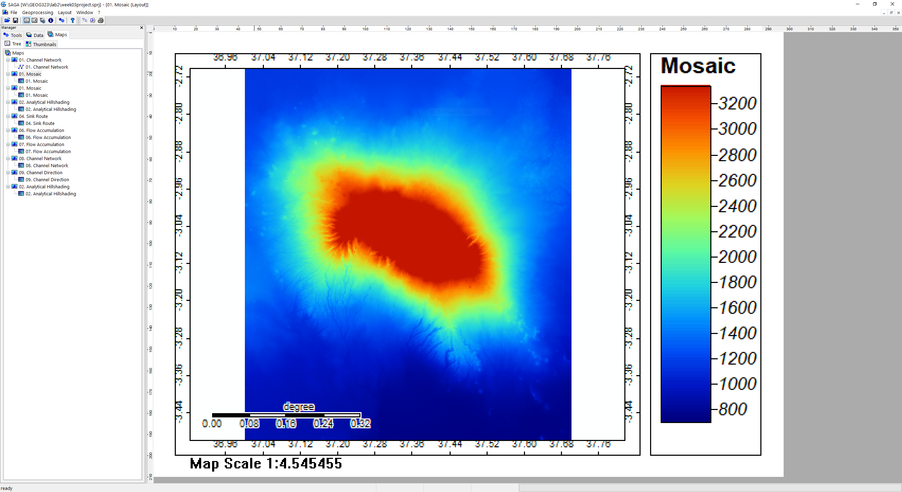

In this lab, we created a Hydrological Flow Model for the area around Mount Kilimanjaro. The following is a workflow of the process:

1. Gather and collect digital elevation model data at this [link]( https://search.earthdata.nasa.gov/)

2. Mosaic the grids together

3. Project the grid to the correct UTM zone

After steps two and three, your DEM should look like this:

4. Create a hillshade to get a visual understanding of the topography you are looking at

5. Use the Sink Drainage Route Detection tool to detect sinks and determine flow through the sinks. This step is necessary so that the hydrological analysis does not get stuck in either real holes or holes created by data errors.

6. Use the Sink Removal tool to remove sinks from the DEM by filling them.

7. Use the Flow Accumulation (Top-Down) tool to calculate where the flow will accumulate.

8. Use the Channel Network tool to show where the streams are.
