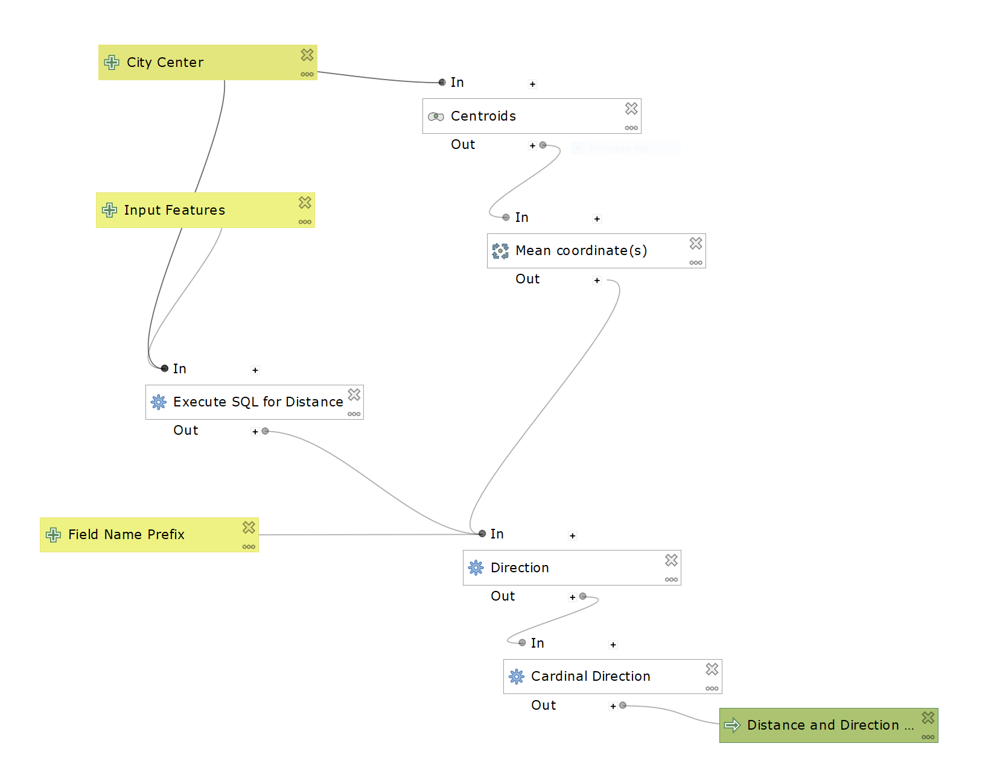
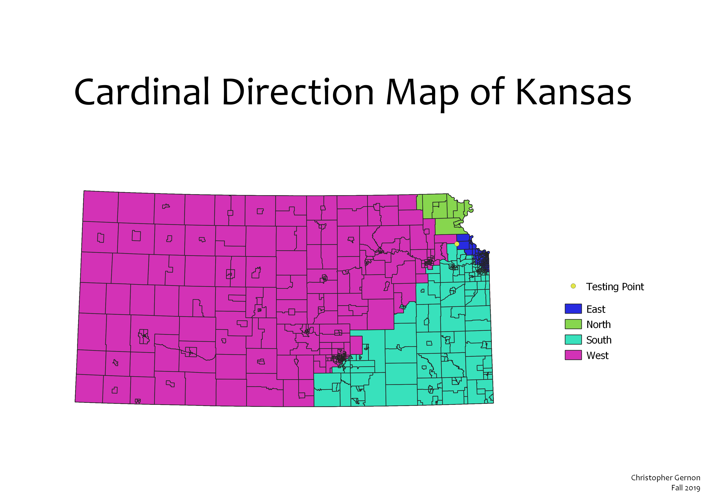
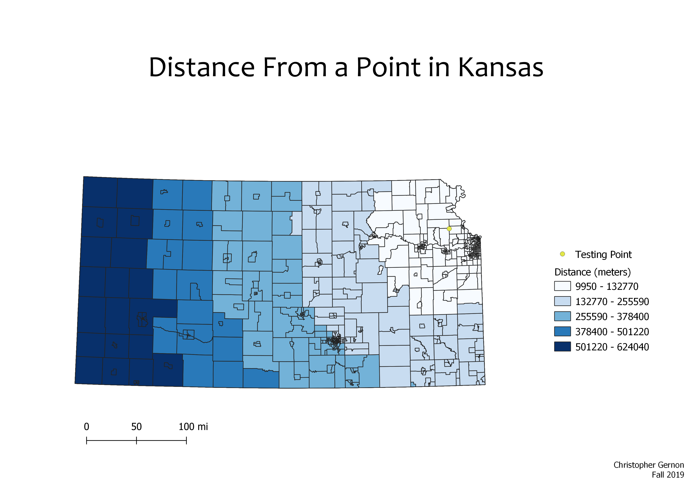

## My First QGIS Model

Background: 

I am Chris Gernon, a junior at Middlebury College. I am taking a class that focuses on the open source element of GIS and other open source programs.

The discourse surrounding GIS is one of great concern for me. GIS is a contradictory technology that simultaneously marginalizes and empowers people and community members. Many view GIS and the work done using GIS as objective and factual. In reality, work done with GIS is incredibly subjective and bias. Because you download shapefiles and other data types from the internet that include neat rows and columns of data, it is easy to forget that a human was the one that collected and made the data. Thus, no data collection process is value free.

Many educators, hiring committees, or learning material frame GIS as a solution to many of the world’s problems. However, not all problems can or should be answered using a GIS. Classrooms, hiring committees, and textbooks a one-dimensional understanding of GIS that creates a dichotomy between those with the discourse around GIS Skepticism and doubt is vital when considering GIS technology and work done using a GIS. It's important to ask questions such as: where is the data coming from? Why was the data collected? Who collected the data?

Furthermore, all GIS software lack features that would make their use and application more inclusive. All data entered into a GIS must be "clean" and formatted in a very specific way. This makes GIS an inherently exclusive software because people need to have the tools and technology to collect data in a certain way in order to put it into a GIS and analyze it.

A GIS needs to be able to display more than cartographic and attribute information and beyond raster’s and vectors. It needs to integrate non-geographic data such as storytelling, mental maps, or oral histories.

There are many ways in which GIS can be used inappropriately. Thus, none of my work should be used with the intent to surveil or harm people or the planet.

QGIS:

In the first lab, we created a model to calculate direction and distance from a point.

The purpose of a model is to allow users to reduce the amount of redundant clicking they have to do. By only having to put in the initial parameters, using a model allows user to experiment with different parameters and data in an efficient manner. The model automates the user experience.

Model:

This model takes two inputs. The first input can be a polygon or a point. It is supposed to be the CBD of an urban area. Users can input a polygon and, by using the centroids and mean coordinates functions, the model will find the centroid of the polygon. However, users cannot put in multiple polygons. Thus, if you have a whole metro area, you have to dissolve all of the tracts before putting the parameters through the model.

SQL in model (distance):

The SQL takes the centroid of the original polygon and transforms it to EPSG: 4326 so that we can caluclate the distance accurately. It then calculates the distance from the CBD to each centroid in each census tract.
```
SELECT *, ST_distance(centroid(transform(geometry, 4326)), transform((SELECT geometry from input1), 4326), TRUE  ) as [%  concat( @fieldnameprefix, 'Dist')%] FROM input2
```

Field Calculator Direction (degrees):

```
degrees( azimuth(  

transform(make_point(  @Mean_coordinate_s__OUTPUT_maxx , @Mean_coordinate_s__OUTPUT_maxy ), 
layer_property( @citycenter, 'crs'), 'EPSG:54004'),

transform(centroid($geometry), layer_property(  @inputfeatures2 ,  'crs'), 'EPSG:54004')

))
```

Direction is calculated using the azimuth() function. The azimuth() function calculates direction in radians. Thus, the degrees() function is used to convert direction from radians to degrees.

Field Calculator Direction (cardinal direction):
```
CASE
WHEN attribute(concat(@fieldnameprefix, 'Dir')) >= 45 AND  attribute(concat(@fieldnameprefix, 'Dir')) <= 135 THEN 'East' 
WHEN attribute(concat(@fieldnameprefix, 'Dir')) >135 AND attribute(concat(@fieldnameprefix, 'Dir')) <=225 THEN 'South'
WHEN attribute(concat(@fieldnameprefix, 'Dir')) >225 AND attribute(concat(@fieldnameprefix, 'Dir')) <=315 THEN 'West'
ELSE 'North'
END

```
The results from the direction calculator are divided into 4 sections and assigned cardinal directions. 



Here are two maps that show the results of my model using the entire states of KS from the test data below.





Here are two graphs I made using the entire state of Kansas. I used an arbitrary point in the Northeast corner of the state as the City Center and all the census tracts as the Input Features. 

This [graph](./dir_plot.html) shows how the direction impacts the median rent based on Census Tracts in Kansas.

This [graph](./dist_plot.html) shows how the distance from the point impacts the median rent based on Census Tracts in Kansas. The jump in Median Rent around 50k is the Kansas City Metropolitan area and the jump around 250k is the Wichita Metropolitan area.

Here are two maps that show the results of the model using the Wichita metropolitcan area from the test data below. 


[Model](./Distance_from_point_final.model3)

[Test Data](./Model_test_data.gpkg)

The test data includes a shp file with Ammerican Community Survey (ACS) data already joined to the Census Tract shp file. I include the tables to show where the data came from. Additionally, I include a shp file of the Wichita metropolitan area. 

[back to Main Page](chriskgernon.github.io/index.md)
