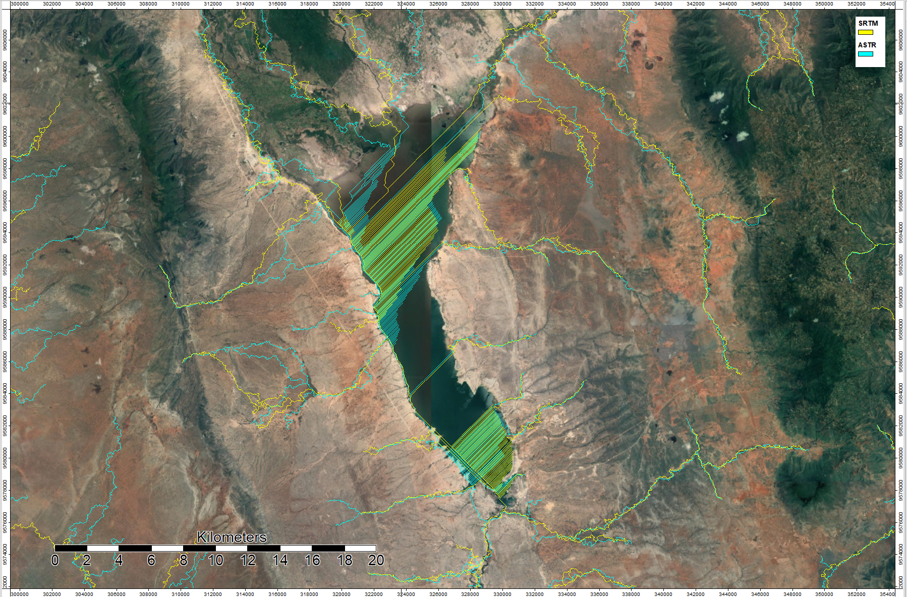

Using ASTER data Model 4003 from the US and Japan, I conducted a terrain anlysis for the area around Mount Kilimanjaro, Tanzania. The analysis was done on SAGA open source GIS.
 
 The following is a workflow of the process:

1. Gather and collect digital elevation model data at this [link]( https://search.earthdata.nasa.gov/)

2. Mosaic the grids together

3. Project the grid to the correct UTM zone

After steps two and three, your DEM should look like this:

4. Create a hillshade to get a visual understanding of the topography you are looking at. I used the default settings for the azimuth : 315 and height : 45.

5. Use the Sink Drainage Route Detection tool to detect sinks and determine flow through the sinks. This step is necessary so that the hydrological analysis does not get stuck in either real holes or holes created by data errors. The blue represents no sinks, and the colored dots show different values of sinks.

6. Use the Sink Removal tool to remove sinks from the DEM by filling them.

7. Use the Flow Accumulation (Top-Down) tool to calculate where the flow will accumulate. The darker the values, the more accumulation.

8. Use the Channel Network tool to show where the streams are.

The analysis above was done using the SAGA interface. This method ends up being quite time consuming when you are interested in analyzing large amount of data. Thus, I wanted to do the analysis again but this time using a different method. First, I wanted to use the command line in order to streamline the analysis. Second, I wanted to use the time saved by using this method to analyze both SRTM and ASTER data to determine how they differ. 

I started by writing and running batch scripts to automate the hydrological analysis process. Batch scripts allow users to change inputs quickly, making it easier to compare analysis using different inputs. 

[Batch script for automating Hydrological Model](automating_hydrological_modeling.md)

Additionally, I examined the NUM files for both ASTER and SRTM to visualize the sources of data for each dataset.

This image shows of a mosaicked and projected NUM file for SRTM. Most of the image uses data from SRTM, but steep mountains and water bodies stand out as data from different sources. 

This image shows the mosaicked and projected Num file for ASTR.

After running an analysis of Mt. Kilimanjaro using both ASTER and SRTM data, I took the difference between the two elevation models using SAGA. This allowed me to determine the areas in the region with the most error.

The difference between the two models is magnified when you look at the hillashade of the two models.

 

