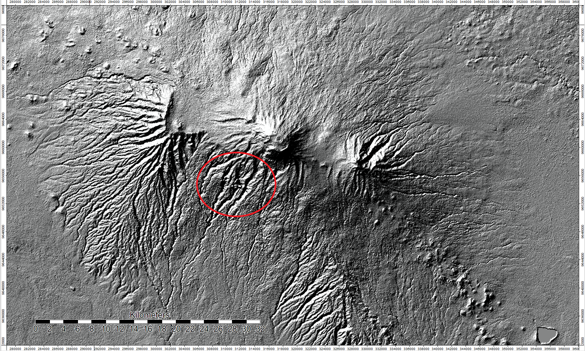

Using ASTER data Model 4003 from the US and Japan, I conducted a terrain anlysis for the area around Mount Kilimanjaro, Tanzania. The analysis was done on SAGA open source GIS.
 
 The following is a workflow of the process:

1. Gather and collect digital elevation model data at this [link]( https://search.earthdata.nasa.gov/)

2. Mosaic the grids together

3. Project the grid to the correct UTM zone

After steps two and three, your DEM should look like this:

4. Create a hillshade to get a visual understanding of the topography you are looking at. I used the default settings for the azimuth : 315 and height : 45.

5. Use the Sink Drainage Route Detection tool to detect sinks and determine flow through the sinks. This step is necessary so that the hydrological analysis does not get stuck in either real holes or holes created by data errors. The blue represents no sinks, and the colored dots show different values of sinks.

6. Use the Sink Removal tool to remove sinks from the DEM by filling them.

7. Use the Flow Accumulation (Top-Down) tool to calculate where the flow will accumulate. The darker the values, the more accumulation.

8. Use the Channel Network tool to show where the streams are.

The analysis above was done using the SAGA interface. This method ends up being quite time consuming when you are interested in analyzing large amounts of data. Thus, I wanted to do the analysis again but this time using a different method. First, I wanted to use the command line in order to streamline the analysis. Second, I wanted to use the time saved by using this method to analyze both SRTM and ASTER data to determine how they differ. 

I started by writing and running batch scripts to automate the hydrological analysis process. Batch scripts allow users to change inputs quickly, making it easier to compare analysis using different inputs. 

[Batch script for automating Hydrological Model](automating_hydrological_modeling.md)

Additionally, I examined the NUM files for both ASTER and SRTM to visualize the sources of data for each dataset.

This image shows of a mosaicked and projected NUM file for SRTM. Most of the image uses data from SRTM, but steep mountains and water bodies stand out as data from different sources. 

This image shows the mosaicked and projected Num file for ASTR.

After running an analysis of Mt. Kilimanjaro using both ASTER and SRTM data, I took the difference between the two elevation models using SAGA. This allowed me to determine the areas in the region with the most error.

The difference between the two models is magnified when you look at the hillashade of the two models.

 
ASTR Hillshade

SRTM Hillshade

When comparing the two hillshades, there is an obivous difference betweeen the two. The red circle in the SRTM hillshade has obivous error shown by the flat divot while the ASTR hillshade is more accurate shown by the congruence inside the red circle with the other parts of the mountain.

Difference in Flow Accumulation between the two datasets.

When comparing the flow accumulation between both datasets, there is major differences between the two in two regions as shown above. It is no coincidence the spots are located at the two steepest areas of the region because those are the areas where it's hardest to aquire accurate data. 

The difference between the two channel networks shown above indicate a major difference between the data.

Conclusion: ASTER is the better dataset when looking in mountanous regions. This is evident by the comparison of the two hillshades and when visualizing the NUM files. The visualization of the SRTM NUM file shows that SRTM used data from ASTER in the particularly mountainous regions. Additionally, the visualization of the difference between the two flow accumulations indicate that one dataset got completely different results in the extrememly mountainous region than the other dataset. This difference shows that ASTR was more accurate than SRTM. Steep ravines cause major uncertainty (like in the places circled in the two hillshades) because there are known values on either side of the ravine but the values on either side are unknown which confuses the flow. This confusion is visualized by the different channel networks in the pictures above. Also, elevation sometimes looks higher over valleys because clouds are constantly over the valley, so the satallite cannot get accurate data. 

Both datasets have significantly different results around the lake. This is because it is a man-made lake created by a dam. Thus, it does not follow conventional flow. Thus, the model just guesses where the flow might go. However, this is not a significant issue because you understand where the water enters and where the water leaves. 

Additionally, both datasets have uncertainty arises in areas where humans have modified the landscape for irrigation and farming purposes. This includes modifying river channels and transforming streams into irrigation channels.

Lastly, difference between the channel networks between the two datasets derives from vegetation hiding natural features. Rivers that have trees on both sides of the shore are going to look higher than area around it because the radar is going to reflect from the canopy not river. And the area next to the river that does not have any canopy will appear lower because the radar will be able to go all the way to the ground before reflecting back up. 

Data Sources: NASA/METI/AIST/Japan Spacesystems, and U.S./Japan ASTER Science Team. ASTER Global Digital Elevation Model V003. 2019, distributed by NASA EODIS Land Processes DAAC

NASA JPL. NASA Shuttle Radar Topography Mission Global 1 arc second. 2013, distributed by NASA EOSDIS Land Processes DAAC

Ran using SAGA version 6.2
