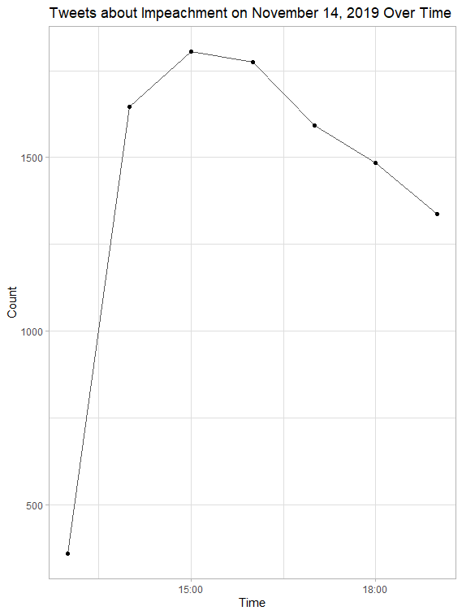

Lab 10

Twitter is


# Method
## Collecting the Data
First, I installed and downloaded all the necessary packages to perform the analysis. 
```R
#install packages for twitter, census, data management, and mapping
install.packages(c("rtweet","tidycensus","tidytext","maps","RPostgres","igraph","tm", "ggplot2","RColorBrewer","rccmisc","ggraph"))


#initialize the libraries. this must be done each time you load the project
library(rtweet)
library(igraph)
library(dplyr)
library(tidytext)
library(tm)
library(tidyr)
library(ggraph)
library(tidycensus)
library(ggplot2)
library(RPostgres)
library(RColorBrewer)
library(DBI)
library(rccmisc)
```

Second, I set up all of the necessary Twitter API information so that I could scrape the data from Twitter. 

```R
twitter_token <- create_token(
  app = "Geog323",  				
  consumer_key = "**********************************",  		
  consumer_secret = "**********************************",
  access_token = "**********************************",
  access_secret = "**********************************"
)
```

Third, I used the ```search_tweets()``` function to collect my dataset of 10000 tweets. I collected tweets from everywhere within 113 miles from Washington D.C. that had either "trump" or "impeachment" or "trial" or "hearing." Twitter only allows apps to collect 18,000 tweets every 15 minutes. So if you are interested in collecting more than 18,000 tweets, users should set```retryonratelimit``` argument to TRUE.

```R
impeachTweets <- search_tweets("trump OR impeachment OR impeach OR trial OR hearing", n=10000, retryonratelimit=FALSE, include_rts=FALSE, token=twitter_token, geocode="38.905008,-77.036571, 113mi")
```

## Temporal Analysis

I created a graph that shows the number of impeachment tweets over time.




The following code was what I used to create the graph. ```ts_data``` and ```ts_plot``` are two functions that are part of the ```rtweet``` library. ```ts_data``` returns data containing the frequency of tweets over a specified interval of time.. ```ts_plot``` creates a ggplot2 plot of the frequency of tweets over a specified interval of time.

```R

impeachTweetsHours <- ts_data(impeachTweets, by="hours")
ts_plot(impeachTweets, by="hours", color= "#565656")+
  labs(title = "Tweets about Impeachment on November 14, 2019 Over Time",
       x = "Time", y = "Count")+
  geom_point()+
  theme_light()
  ``` 
  
  
  

 
  ## FIND ONLY PRECISE GEOGRAPHIES
  
  About 0.85% tweets are geo-tagged, which means that the latitude and longitude of a tweet is recorded (Sloan and Morgan 2015). This location data is incredibly valuable for social scientist. It enables them to establish the geographic context in which the tweeter is located when the tweet. As the table below indicates, of the 10000 tweets I collected, 319 contained a place type.
  
  | Place Type| Count|
| ------------- | ------------- |
| admin|26|
| city|271|
|neighborhood|1|
|poi|21|
|NA|9681|
  
reference for lat_lng function: https://rtweet.info/reference/lat_lng.html
adds a lat and long field to the data frame, picked out of the fields you indicate in the c() list
sample function: lat_lng(x, coords = c("coords_coords", "bbox_coords"))

This chunk of code counts the number of unique place types in the dataset, which is how I got the results for the table above.


```
# list and count unique place types
# NA results included based on profile locations, not geotagging / geocoding. If you have these, it indicates that you exhausted the more precise tweets in your search parameters
count(impeachTweets, place_type)
```

The ```lat_lng()``` function adds a lat long field to the dataframe and converts GPS coordinates into lat and lng columns.
```R
impeachTweets <- lat_lng(impeachTweets,coords=c("coords_coords"))
```

Use the ```subset()``` to isloate specific data from another dataframe. Below, I am selecting all tweets with lat and lng columns (from GPS) or designated place types of your choosing.
```R
impeachTweetsGeo <- subset(impeachTweets, place_type == 'city'| place_type == 'neighborhood'| place_type == 'poi' | !is.na(lat))
```
#convert bounding boxes into centroids for lat and lng columns
impeachTweetsGeo <- lat_lng(impeachTweetsGeo,coords=c("bbox_coords"))

# Network Analysis

#create network data frame. Other options for 'edges' in the network include
impeachTweetNetwork <- network_graph(head(impeachTweetsGeo,100), c("quote", "retweet", "mention", "reply"))

plot.igraph(impeachTweetNetwork, vertex.size=4, vertex.label = NA, vertext.label.cex = .01, edge.arrow.size = .4, edge.size= 100, layout=layout_in_circle(impeachTweetNetwork))

# Text / Contexual Analysis

The ```plain_tweets``` function cleans up the tweet content into more plain text. This is important to do if trying to do any type of analysis on the text of tweets.
```R
impeachTweetsGeo$text <- plain_tweets(impeachTweetsGeo$text)
```

This chunk of code creates a dataframe for the geographic data and the text of each tweet and stores them in a variable called ```impeachText```. Then, the ```unnest_tokens()``` function is used to create a dataframe that converts all words in every tweet into individual rows. Meaning, each word is a different row in the dataframe. This step is important for running analysis on text because it allows R to iterate through each word in every tweet efficiently. 
```R
impeachText <- select(impeachTweetsGeo,text)
impeachWords <- unnest_tokens(impeachText, word, text)
```


Another important step for text analysis in R is removing the stop words. Stop words are the most common words in a language and are typically filtered out before running analysis on language data. This is so unimportant words like "the" or "a" are not part of your analysis and do not scew your results.

### how many words do I have including the stop words?
```R
count(impeachWords)
```

This is how I removed stop words from my dataframe. First, I created a list of stop words and added "t.co" twitter links to the list because it was included in most tweets when I got the data from twitter. Then, using the ```anti_join()``` function, I removed the stop words from my ```impeachWords``` dataframe.

```R
data("stop_words")
stop_words <- stop_words %>% add_row(word="t.co",lexicon = "SMART")

winterWords <- winterWords %>%
  anti_join(stop_words) 
```
### how many words after removing the stop words?
```R
count(winterWords)
```
I created a bar graph that shows the 15 most frequent words found in the tweets I scraped. The code I used to create the graph appears after the picture.


```R
impeachWords %>%
  count(word, sort = TRUE) %>%
  top_n(15) %>%
  mutate(word = reorder(word, n)) %>%
  ggplot(aes(x = word, y = n)) +
  geom_col(fill ="steelblue") +
  geom_text(aes(label=n ), vjust=1.6, hjust= 1.3,color="white", size=3.5)+
  xlab(NULL) +
  coord_flip() +
  labs(x = "Count",
       y = "Unique words",
       title = "Count of unique words found in tweets")+
  theme_minimal()
```


winterWordPairs <- winterTweetsGeo %>% select(text) %>%
  mutate(text = removeWords(text, stop_words$word)) %>%
  unnest_tokens(paired_words, text, token = "ngrams", n = 2)

winterWordPairs <- separate(winterWordPairs, paired_words, c("word1", "word2"),sep=" ")
winterWordPairs <- winterWordPairs %>% count(word1, word2, sort=TRUE)

#graph a word cloud with space indicating association. you may change the filter to filter more or less than pairs with 10 instances
winterWordPairs %>%
  filter(n >= 5) %>% # we changed this to 2, rather than 15
  graph_from_data_frame() %>%
  ggraph(layout = "fr") +
  # geom_edge_link(aes(edge_alpha = n, edge_width = n)) +
  geom_node_point(color = "darkslategray4", size = 3) +
  geom_node_text(aes(label = name), vjust = 1.8, size = 3) +
  labs(title = "Word Network: Tweets during the 2013 Colorado Flood Event",
       subtitle = "September 2013 - Text mining twitter data ",
       x = "", y = "") +
  theme_void()


[twitter data](./status_id.csv)

Citations:
Sloan L, Morgan J (2015) Who Tweets with Their Location? Understanding the Relationship between Demographic Characteristics and the Use of Geoservices and Geotagging on Twitter. PLoS ONE 10(11): e0142209. https://doi.org/10.1371/journal.pone.0142209
