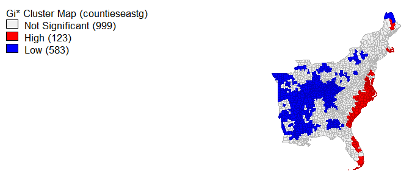
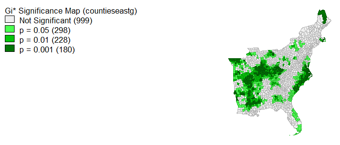

Lab 10

Twitter is






# Method
## Collecting the Data
First, I installed and downloaded all the necessary packages to perform the analysis. 
```R
#install packages for twitter, census, data management, and mapping
install.packages(c("rtweet","tidycensus","tidytext","maps","RPostgres","igraph","tm", "ggplot2","RColorBrewer","rccmisc","ggraph"))


#initialize the libraries. this must be done each time you load the project
library(rtweet)
library(igraph)
library(dplyr)
library(tidytext)
library(tm)
library(tidyr)
library(ggraph)
library(tidycensus)
library(ggplot2)
library(RPostgres)
library(RColorBrewer)
library(DBI)
library(rccmisc)
```

Second, I set up all of the necessary Twitter API information so that I could scrape the data from Twitter. 

```R
twitter_token <- create_token(
  app = "Geog323",  				
  consumer_key = "**********************************",  		
  consumer_secret = "**********************************",
  access_token = "**********************************",
  access_secret = "**********************************"
)
```

Third, I used the ```search_tweets()``` function to collect my dataset of 10000 tweets. I collected tweets from everywhere within 113 miles from Washington D.C. that had either "trump" or "impeachment" or "trial" or "hearing." Twitter only allows apps to collect 18,000 tweets every 15 minutes. So if you are interested in collecting more than 18,000 tweets, users should set```retryonratelimit``` argument to TRUE.

```R
impeachTweets <- search_tweets("trump OR impeachment OR impeach OR trial OR hearing", n=10000, retryonratelimit=FALSE, include_rts=FALSE, token=twitter_token, geocode="38.905008,-77.036571, 113mi")
```

## Temporal Analysis

I created a graph that shows the number of impeachment tweets over time.
```R
#create temporal data frame & graph it
winterTweetHours <- ts_data(winterTweets, by="hours")
ts_plot(winterTweets, by="hours", color= "#565656")+
  labs(title = "Tweets about Impeachment on November 14, 2019 Over Time",
       x = "Time", y = "Count")+
  geom_point()+
  theme_light()
  ```
  
  ## FIND ONLY PRECISE GEOGRAPHIES
  
  
```
```
