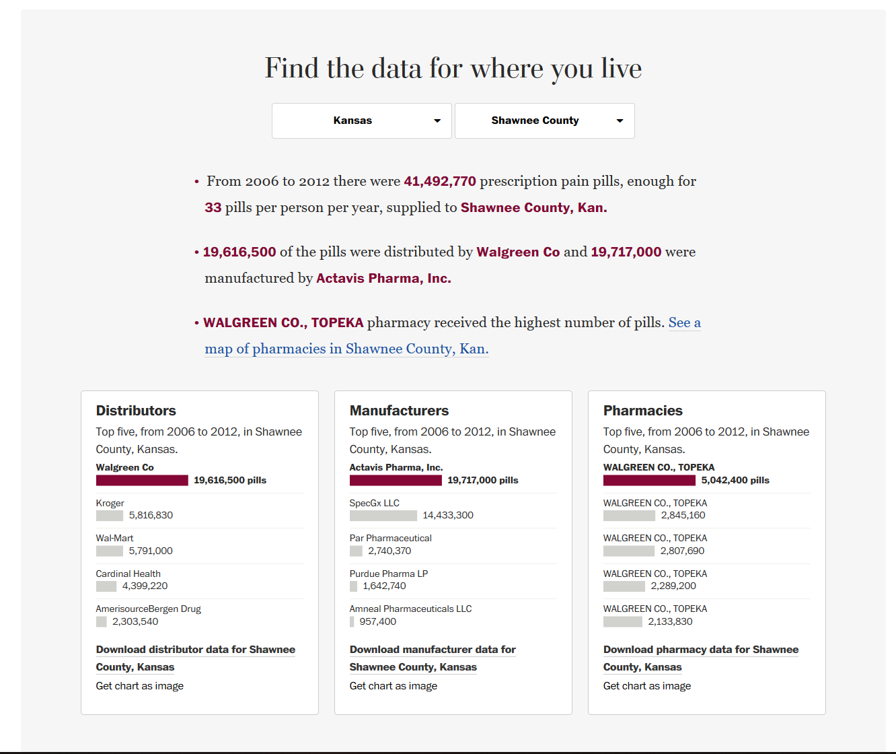
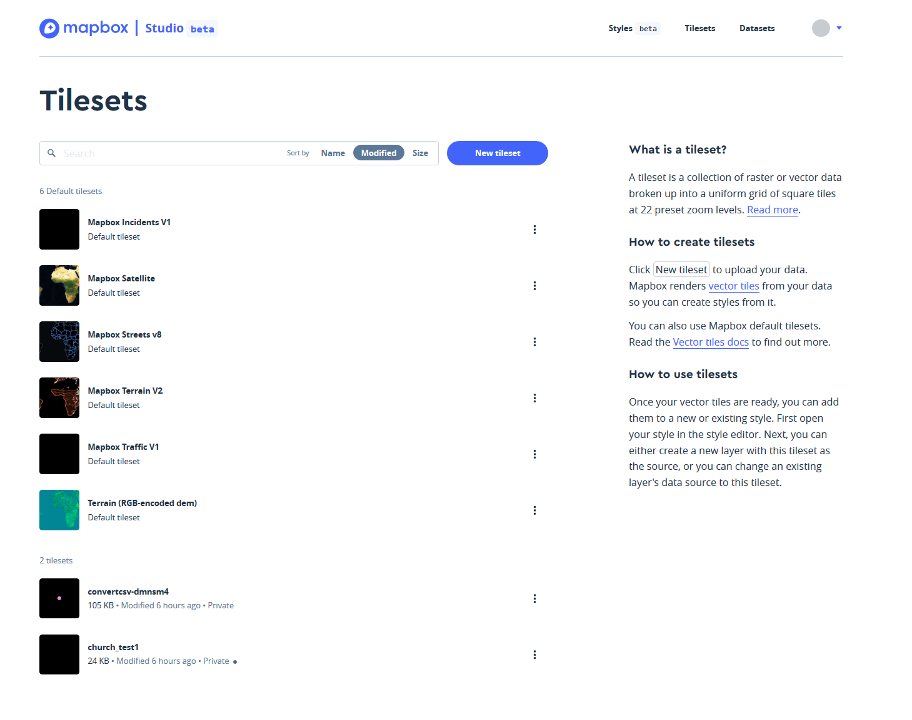
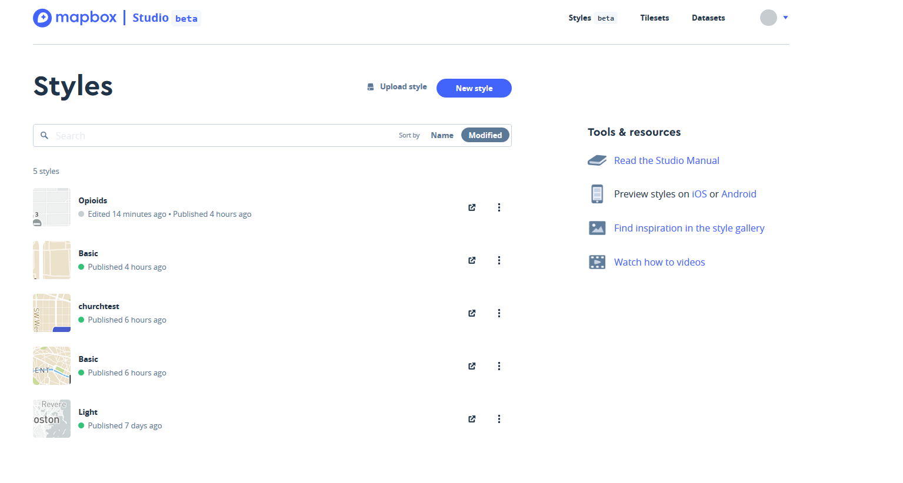
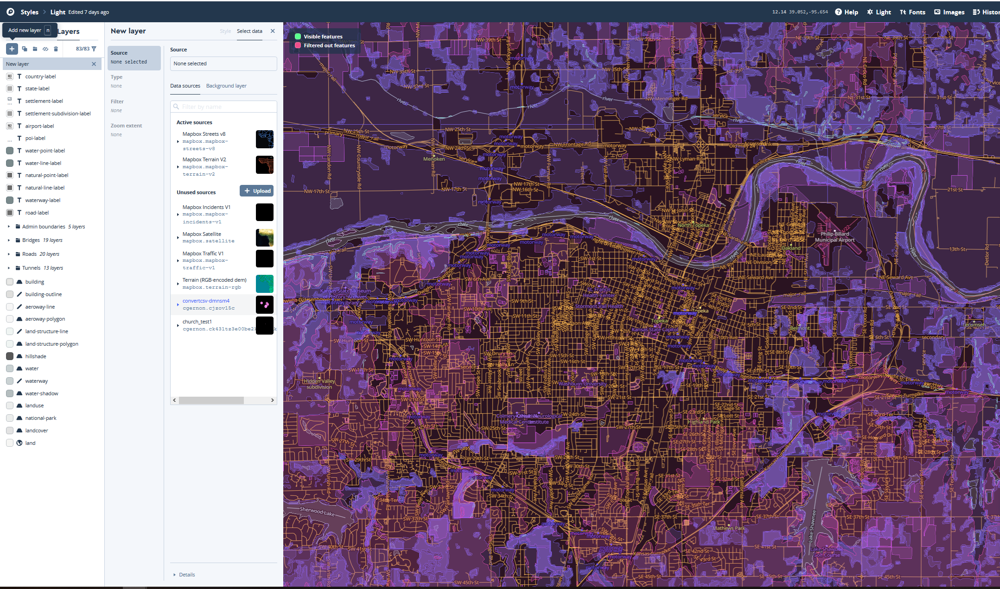
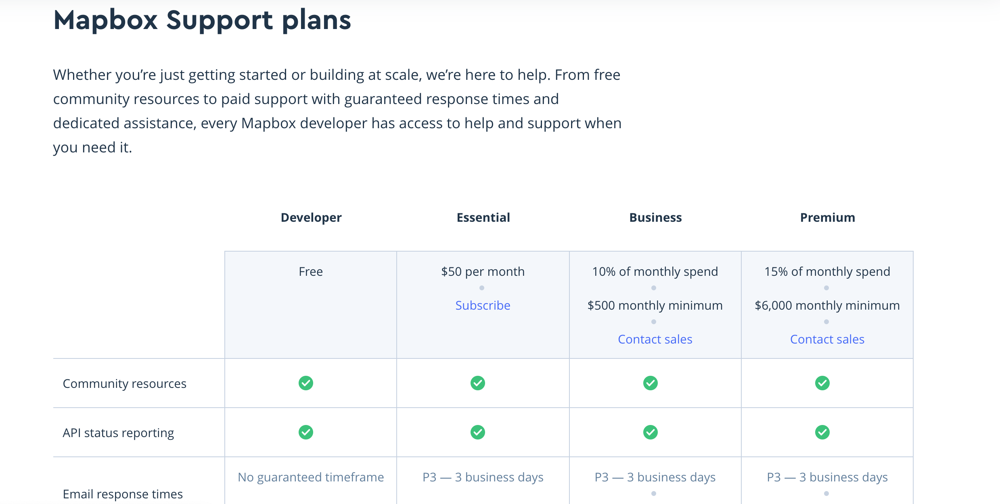

# Purpose
The purpose of my final project was to learn something new. I am interested in data visualization and had minimal experience with interactive web mapping, so I decided to learn how to use [mapbox](https://www.mapbox.com/). My map currently visualizes opiod distribution data in Shawnee County. I chose Shawnee County because that is where I am from, and opioids were prevelant in my high school. I want people to understand how ubiquitous opioids are, even in a not-well-known place like Topeka, KS.

# Sources and Help
  *  https://docs.mapbox.com/mapbox-gl-js/example/cluster-html/
  * https://docs.mapbox.com/mapbox-gl-js/example/cluster/
  * https://docs.mapbox.com/help/tutorials/add-points-pt-3/
  * https://docs.mapbox.com/help/tutorials/add-points-pt-2/
  * https://docs.mapbox.com/help/tutorials/add-points-pt-1/
  * QGIS to convert shp file to GEOJSON
  * DB Manager in QGIS to run SQL
  * Excel to clean data
  * http://www.convertcsv.com/csv-to-geojson.htm
  
# What I learned
* Mapbox
* Javascript
	* How to visualize clusters
	* How to make pop-ups
* Working with geogjson files
* Working with HTML
* Analyzing large data
# Methods

My approach took two methods. The first method I did not thinking through the problem very logically. 

## Method 1

First, I downloaded the opiod data from a Washington Post Database found on this [website](https://www.washingtonpost.com/graphics/2019/investigations/dea-pain-pill-database/). 



Second, I needed to geocode the addresses from the data because there were no longitude latitude coordinates. I used the plug-in on Google Sheets titled ```Geocode by Awesome Table```. Unfortunatley, there was a limit on the number of points I could geocode in one day, so I was only able to geocode 9,720 of the 126,504 entried for the count. Additionally, because it is such a large dataset, I was not even able to load all of the data into a Google Sheet or else the website would crash.

Third, I used a (CSV to GEOGJON converter website)[http://www.convertcsv.com/csv-to-geojson.htm] to convert the latitude, longitude coordinates into a GEOJSON, so I could visualize the data in Mapbox.

Fourth, uploading my data took several steps. I made a [Mapbox](https://www.mapbox.com/) account, and I used Mapbox studio to upload my data and style my basemap and symbols. In order to do this I first uploaded my data as a tileset in Mapbox Studio by clicking on tilesets and uploading the file from my computer.



Next, I converted my dataset into a tileset. Then, I selected the monochrome style. Finally, I uploaded my data into the style.  

First, I downloaded the opiod data from a Washington Post Database found on this [website](https://www.washingtonpost.com/graphics/2019/investigations/dea-pain-pill-database/). 


Second, I needed to geocode the addresses from the data because there were no longitude latitude coordinates. I used the plug-in on Google Sheets titled ```Geocode by Awesome Table```. Unfortunatley, there was a limit on the number of points I could geocode in one day, so I was only able to geocode 9,720 of the 126,504 entries for the count. Additionally, because it is such a large dataset, I was not even able to load all of the data into a Google Sheet or else the website would crash.

Third, I used a (CSV to GEOGJON converter website)[http://www.convertcsv.com/csv-to-geojson.htm] to convert the latitude, longitude coordinates into a GEOJSON, so I could visualize the data in Mapbox.

Fourth, uploading my data took several steps. I made a [Mapbox](https://www.mapbox.com/) account, and I used Mapbox studio to upload my data and style my basemap and symbols. In order to do this I first uploaded my data as a tileset in Mapbox Studio by clicking on new tileset and uploading the file from my computer.


Then, I clicked the styles tab and selected new styles. I selected the monochrome style to start out as my basemap.



Finally, I uploaded my data into a new layer. I did this by first clicking on the ``+`` sign in the left corner. Then, I toggled over to the ```select data``` tab on the panel that popped out. I then selected the tileset I uploaded and chose to visualize it as a circle.



## Method 2

I  had difficulty in method 1 processing the dataset because it was so large. The dataset is set up so each dispense of opioids is a row in the table. However, I did not care as much about each dispense. Instead, I cared about the total number of pills dispensed in the dataset. Thus, I took a new approach. 

First, I needed to condense the data so I could sum the quantity column efficiently. There are only about 60 locations that dispensed opioids in Topeka, KS. Thus, all I needed to do was use the ```GROUP BY``` function in SQL to condense the data and sum it. 

I uploaded my data into my PostGIS database (see the Dar Es Salaam lab to learn how to do that) and entered this SQL. It sums the quantity column based on which quantities have the same address.

```sql
SELECT buyer_address1,
sum(cast(quantity as float))
FROM shawnee_county2
GROUP BY buyer_address1
```
Now my dataset was only 60 rows-- much more  manageable. Now I could geocode all of the data instead of just the subset of it.

I followed the same workflow as method 1 starting at the second point from here on out.

The following is my html file. Instead of explaining it chunk by chunk, I explain everything with comments in the code.

```html
<!DOCTYPE html>
<html>
  <head>
    <meta charset='utf-8' />
    <title>Points on a map</title>
    <meta name='viewport' content='initial-scale=1,maximum-scale=1,user-scalable=no' />
    <script src='https://api.tiles.mapbox.com/mapbox-gl-js/v1.6.0/mapbox-gl.js'></script>
    <link href='https://api.tiles.mapbox.com/mapbox-gl-js/v1.6.0/mapbox-gl.css' rel='stylesheet' />
    <style>
      body {
        margin: 0;
        padding: 0;
      }

      #map {
        position: absolute;
        top: 0;
        bottom: 0;
        width: 100%;
      }
    </style>
  </head>
  <body>
    <div id='map'></div>
    <script>
	//This is where you put the accessToken that Mapbox makes for you
    mapboxgl.accessToken = 'pk.eyJ1IjoiY2dlcm5vbiIsImEiOiJjazNxcnB3MXYwNHRiM2RsZGl4cWc2bTE3In0.z5PVJ_JdlcwAfNEUUwSaxA'; // replace this with your access token
    var map = new mapboxgl.Map({
      container: 'map',
	  //This is where you put the style code that you created in Mapbox. It contains all the information for you basemap
      style: 'mapbox://styles/cgernon/ck437z8l00u0l1cpb6rx02jd9', // replace this with your style URL
      center: [-95.697003, 39.030446],
      zoom: 11
    });
	//This chunk of code loads the shawnee county polygon layer
map.on('load', function() {
map.addLayer({
'id': 'shawnee_county',
'type': 'fill',
'source': {
'type': 'geojson',
'data': './shawnee_county.geojson'
},
'layout': {},
'paint': {
'fill-color': '#088',
'fill-opacity': 0.1,
'fill-antialias' : true,
'fill-outline-color': '#000000'
}})
});

// This is the code that inserts the popup function
map.on('click', function(e) {
  var features = map.queryRenderedFeatures(e.point, {
    layers: ['location'] // replace this with the name of the layer
  });

  if (!features.length) {
    return;
  }

  var feature = features[0];
  feature.properties.ID

  var popup = new mapboxgl.Popup({ offset: [0, -15] })
    .setLngLat(feature.geometry.coordinates)
    .setHTML('<h3>' + 'Total number of opiods dispensed at this location: ' + feature.properties.sum + '</h3><p>') //+ feature.properties.QUANTITY + '</p>')
    .addTo(map);
});
//This is the chunk of code that creates the clusters you see right when you load the page
map.on('load', function() {
// Add a new source from our GeoJSON data and set the
// 'cluster' option to true. GL-JS will add the point_count property to your source data.
map.addSource('geometry', {
type: 'geojson',
// Point to GeoJSON data. This code visualizes every dispense of opiod in Shawnee County
data:
'./distributors.geojson',
cluster: true,
clusterMaxZoom: 11, // Max zoom to cluster points on
clusterRadius: 20 // Radius of each cluster when clustering points (defaults to 50)
});

map.addLayer({
id: 'clusters',
type: 'circle',
source: 'geometry',
filter: ['has', 'point_count'],
paint: {
// Use step expressions (https://docs.mapbox.com/mapbox-gl-js/style-spec/#expressions-step)
// with three steps to implement three types of circles:
//   * Blue, 20px circles when point count is less than 100
//   * Yellow, 30px circles when point count is between 100 and 750
//   * Pink, 40px circles when point count is greater than or equal to 750
'circle-color': [
'step',
['get', 'point_count'],
'#51bbd6',
100,
'#f1f075',
750,
'#f28cb1'
],
'circle-radius': [
'step',
['get', 'point_count'],
20,
100,
30,
750,
40
]
}
});
 
map.addLayer({
id: 'cluster-count',
type: 'symbol',
source: 'geometry',
filter: ['has', 'point_count'],
layout: {
'text-field': '{point_count_abbreviated}',
'text-font': ['DIN Offc Pro Medium', 'Arial Unicode MS Bold'],
'text-size': 12
}
});
 

 
// inspect a cluster on click
map.on('click', 'clusters', function(e) {
var features = map.queryRenderedFeatures(e.point, {
layers: ['clusters']
});
var clusterId = features[0].properties.cluster_id;
map.getSource('geometry').getClusterExpansionZoom(
clusterId,
function(err, zoom) {
if (err) return;
 
map.easeTo({
center: features[0].geometry.coordinates,
zoom: zoom
});
}
);
});
 
map.on('mouseenter', 'clusters', function() {
map.getCanvas().style.cursor = 'pointer';
});
map.on('mouseleave', 'clusters', function() {
map.getCanvas().style.cursor = '';
});
});

    </script>
  </body>

</html>
```
 
# [Final Product](./opiod_test2.html)

### How to change and alter my visualizations with your own ideas
 * Create a new folder to store the files
 * download the [html](./opiod_test2.html)
 * download the [geojson](./shawnee_county.geojson/) file for Shawnee County
 * download the [geojson](./opioid_test2.geojson/) file for the number of dispenses by distributors
 * open the HTML file in firefox
 * Why do I not need to download the sum.geojson file for the popups?
       That information is stored in the tileset that I uploaded to Mapbox. Therefore, I can call that data in my html without having it stored on my actual computer
       
[Opioid Map](./opiod_test2.html)

### Legend for map:

Each black point represents the location of an opioid distributor.
The size of the heat symbol represents the number of dispenses by the distributor.
The clusters represent the number of dispenses at the location-- similar to the heat symbol.

### Future improvements

I would add a real legend to the map. Additionally, there was some issues visualizing my clusters based on the type of internet browser used. Firefox proved to be the least bugger. The cluster visualizations did not appear on chrome or edge. Also, I would visualize the location of each distributor based on the total number of pills they dispensed.

# Discussion

The purpose of this class was to learn about open-source software and the ethics of transparency, accessability, and reproducibility. Mapbox presents an interesting case when it comes to open-source. It started as an open-source project, and it is responsible for a lot of the up-keep and comprehensiveness of Open Street Maps. Additionally, they are significant contributors to Mapbox GL-JS JavaScript library and Leaflet JavaScript library. However, recently they now require payment in order to access all of their features, particularly in Mapbox Studio. Every service they offer is free for those who do not require a high volume of monthly requests. Depending on what resource you want to use, you are required to pay a couple of dollars if you need more than 50,000, 100,0000, or 750,000 requests per month, depending on the product. Additionally, they offer both paid and free support for Mapbox projects. Here is a the listing of their prices.




Thus, Mapbox is accessible for low-volume users. Granted, they only ask for a couple dollars for a 10 fold increase in requests. However, it does create a grey area and begs the question, at what point does something no longer become open-source? The organization used to be completely open-source and free. As the company continues to grow, will they slowly become less and less open-source? Or are they determined to stick to their founding philosophy and just require money for high volume requests so the workers receive compensation for their work? I have a feeling this question will be answered in the coming years. 

