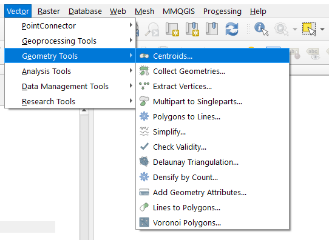
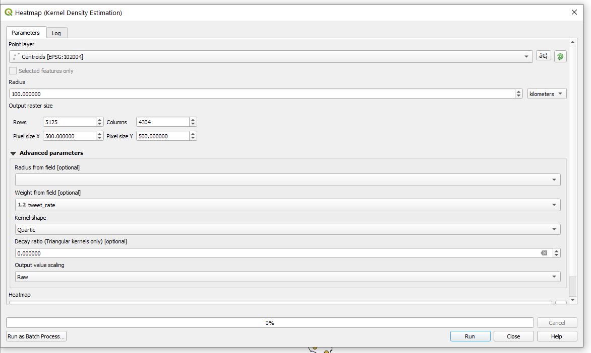
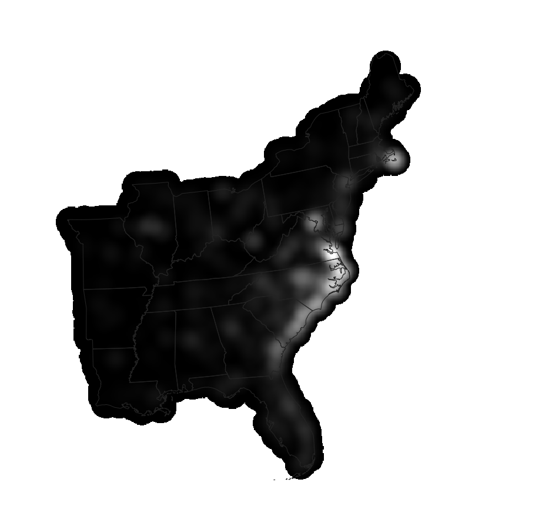

# Methods
## Spatial Analysis in PostGIS
Through QGIS and DB Manager, prepare twitter and county data for spatial analysis and count tweets by County with a spatial join.

### Cleaning and gathering data
First, look in my methods section of my Twitter lab to learn how I uploaded twitter data and county data into my PostGIS database. Second, I added a projected coordinate system to my PostGIS database. I chose the USA Contiguous Lambert Conformal Conic projection because I needed a projection that works well for calculating distance and area over the Eastern United States. It did not exists in the database's ```spatial_ref_sys``` table so I went to https://www.spatialreference.org and copied the PostGIS insert statement. The statement inexplicable has a 9 to the beginning of the first CRS id, so I removed the 9 in order to make the code work.

```SQL
INSERT into spatial_ref_sys (srid, auth_name, auth_srid, proj4text, srtext) values ( 102004, 'esri', 102004, '+proj=lcc +lat_1=33 +lat_2=45 +lat_0=39 +lon_0=-96 +x_0=0 +y_0=0 +ellps=GRS80 +datum=NAD83 +units=m +no_defs ', 'PROJCS["USA_Contiguous_Lambert_Conformal_Conic",GEOGCS["GCS_North_American_1983",DATUM["North_American_Datum_1983",SPHEROID["GRS_1980",6378137,298.257222101]],PRIMEM["Greenwich",0],UNIT["Degree",0.017453292519943295]],PROJECTION["Lambert_Conformal_Conic_2SP"],PARAMETER["False_Easting",0],PARAMETER["False_Northing",0],PARAMETER["Central_Meridian",-96],PARAMETER["Standard_Parallel_1",33],PARAMETER["Standard_Parallel_2",45],PARAMETER["Latitude_Of_Origin",39],UNIT["Meter",1],AUTHORITY["EPSG","102004"]]');
```
I confirmed that the insert worked with the query:
```SQL
select * from spatial_ref_sys where srid = 102004;
```
I added a geometry column for both sets of Twitter Data and transformed the geometries into the  USA Contiguous Lambert Conformal Conic. Then, I got rid of all the counties that were not necessary (not on the East Coast).

```SQL
SELECT AddGeometryColumn('public','dorian', 'geom3',  102004, 'POINT', 2);

SELECT AddGeometryColumn('public','november', 'geom3',  102004, 'POINT', 2);

/* transform geom column*/
UPDATE dorian
SET geom3 = st_transform( st_setsrid( st_makepoint(lng,lat),4326), 102004);

UPDATE november
SET geom3 = st_transform( st_setsrid( st_makepoint(lng,lat),4326), 102004);

UPDATE counties SET geometry = st_transform(geometry,102004);


SELECT populate_geometry_columns('counties':: regclass);

/* getting rid of the counties we do not need */
DELETE FROM counties
WHERE "STATEFP" NOT IN ('54', '51', '50', '47', '45', '44', '42', '39', '37',
'36', '34', '33', '29', '28', '25', '24', '23', '22', '21', '18', '17',
'13', '12', '11', '10', '09', '05', '01');
```
### Analysis

I counted the number of each type of tweet by county using the following code. First, I added a text column of length 5 to each twitter layer. Then, I set the new geoid columns equal to the geoid of the county they intersect:

```SQL
/* count the number of each type of tweet by county*/
ALTER TABLE november ADD COLUMN geoid varchar(5);


UPDATE november
SET geoid = "GEOID"
FROM counties
WHERE st_intersects(counties2.geometry, november.geom3);

UPDATE dorian
SET geoid = "GEOID"
FROM counties
WHERE st_intersects(counties2.geometry, dorian.geom3);
```
Next, I made two new tables for each twitter layer. I grouped the twitter layers while counting the number of tweets.
```SQL
/* Group twitter layers while counting the number of tweets*/
CREATE TABLE novembercounts AS
SELECT geoid, count(november.geoid) 
FROM november
group by november.geoid;

CREATE TABLE doriancounts AS
SELECT geoid, count(dorian.geoid)  as count
FROM dorian
group by dorian.geoid;

/* add columns */
ALTER TABLE counties ADD COLUMN dorian_tweets int;

ALTER TABLE counties ADD COLUMN november_tweets int;

UPDATE counties
SET dorian_tweets = 0;

UPDATE counties
SET november_tweets = 0;

UPDATE counties
SET dorian_tweets = count
FROM doriancounts
WHERE doriancounts.geoid = counties."GEOID";


UPDATE counties
SET november_tweets = count
FROM novembercounts
WHERE novembercounts.geoid = counties."GEOID";
```
Finally, I normalized the Twitter data using the normalized tweet difference index.

```SQL
ALTER TABLE counties2 ADD COLUMN tweet_rate real;

UPDATE counties
SET tweet_rate = (1*1.000000)*(dorian_tweets/"POP") * 10000;


ALTER TABLE counties2 ADD COLUMN ndti real;

UPDATE counties
SET ndti = (1*1.0000)*(dorian_tweets- november_tweets)/(dorian_tweets + november_tweets) *(1*1.0000)
where dorian_tweets + november_tweets >0;
```

## Spatial Hotspot Analysis with GeoDa

GeoDa is a free and open source software tool that serves as an introduction to spatial data analysis. It is designed to facilitate new insights from data analysis by exploring and modeling spatial patterns.

## Heatmap (Kernal Density) Visualization of Tweets
First, I put my county file from my database into QGIS. The Heatmap (Kernal Density) function in QGIS requires point geometry input. So I took the centroids of my county polygons.


Next, I used the Heatmap (Kernal Density) function with the inputs (left) and got this output (right):

|Input|Output|


  | Place Type| Count|
| ------------- | ------------- |
| admin|26|
| city|271|
|neighborhood|1|
|poi|21|
|NA|9681|


