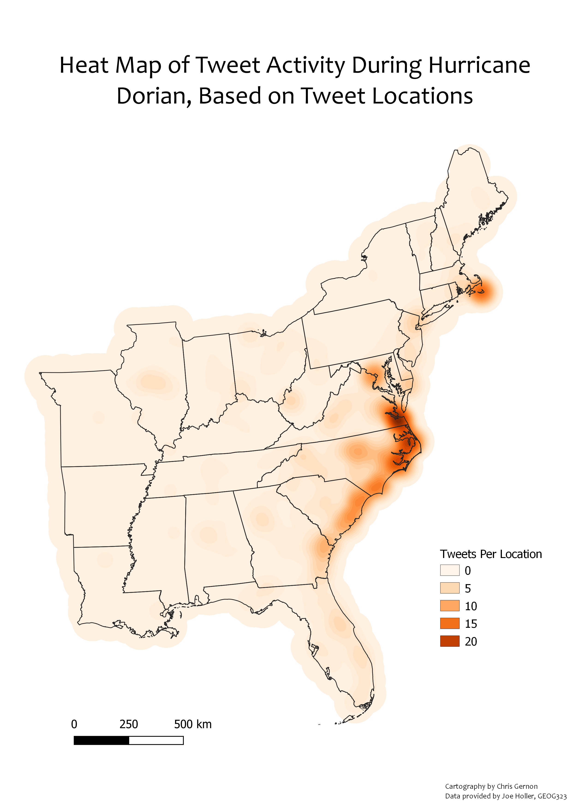

Hello! My name is Chris Gernon. I'm a junior at Middlebury College studying Geography. This semester I am taking an Open Source GIS class. We will practice techniques that include data acquisition and preparation for analysis, spatial SQL database queries, automating analysis, spatial interpolation, testing sensitivity to error and uncertainty, and data visualization. We will read and apply critical research of GIS as a subject and with GIS as a methodology. I will be continually updating this Github page with the projects we do in the class. Hope you enjoy.

# Big Data/Twitter Analysis
[twitter](./Twitter/index.md/)

|||
| ------------- | ------------- |
|||
| ------------- | ------------- |

# Multi-criteria Analysis of Hazard Vulnerability 

|||
| ------------- | ------------- |

# Analyzing Resilience in Dar Es Salaam using OSM
[Leaflet](./Dar_Es_Salaam/index.md)

This is an analysis I did using data from the Tanzanian Resilience Academy. I was interested in finding the minumum average distance of waste sites to drain locations in order to determine which subwards are likely to experience blocked drains duing a flood. 

||
| ------------- |

# Using SAGA to model Hydrology and Error

[SAGA](./SAGA/Hydrology_model.md)

This link consists of my work done using SAGA. Here are some of my final products:

|||
| ------------- | ------------- |
|| |

# Modeling Direction and Distance in QGIS

[QGIS](./QGIS/qgisModel.md)

This link shows modeling I've done using QGIS. Here are some of my final products:

|||
| ------------- | ------------- |

[Blog Posts](./blogpost2/blogposts.md)

