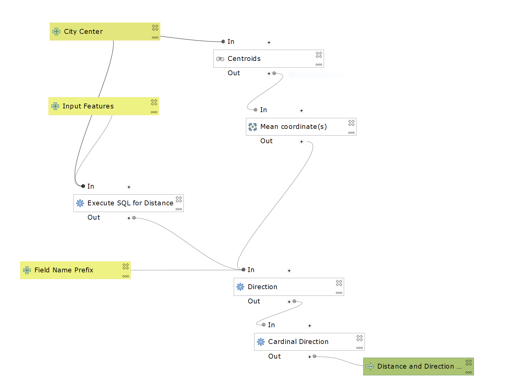

## My First QGIS Model

I am Chris Gernon, a junior at Middlebury College. I am taking a class that focuses on the open source element of GIS and other open source programs. 

The discourse sourrounding GIS is one of great concern for me. Many view GIS and the work done using GIS as objective and factual. In reality, work done with GIS is incredibly subjective and bias. Many educators, hiring committees, or learning material frame GIS as a solution to many of the worlds problems. However, not all problems that can Classrooms, hiring committees, and textbooks a one-dimensional understanding of GIS that creates a dichotomy between those with  the discourse around GIS Skepticism and doubt is vital when considering GIS technology and work done using a GIS. It's important to ask questions such as: where is the data coming from? Why was the data collected? Who collected the data? 

Furthermore, all GIS software lack features that woud make their use and application more inclusive. All data entered into a GIS must be "clean" and 
There are many way in which GIS can be used inappropriatley. Thus, none of my work should be used with the intent to surveil or harm people or the planet.

In the first lab, we created a model to calculate direction and distrance from a point.

Here are two maps that show the results of my model using the test data below.

Here are two graphs I made using the entire state of Kansas. I used an arbitrary point in the Northeast corner of the state as the City Center and all the census tracts as the Input Features. 

This [graph](dir_plot.html) shows how the direction impacts the median rent based on Census Tracts in Kansas.

This [graph](dist_plot.html) shows how the distance from the point impacts the median rent based on Census Tracts in Kansas. The jump in Median Rent around 50k is the Kansas City Metropolitan area and the jump around 250k is the Wichita Metropolitan area.

[Model](Distance_from_point_final.model3)

[Test Data](Model_test_data.gpkg)

The test data includes a shp file with Ammerican Community Survey (ACS) data already joined to the Census Tract shp file. However, I include the tables to show where the data came from. 

[back to Main Page](index.md)
