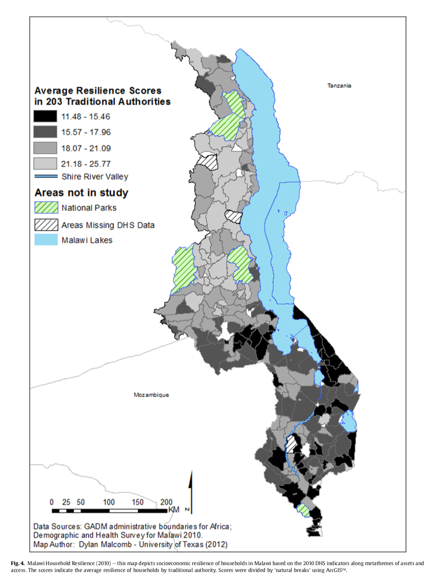
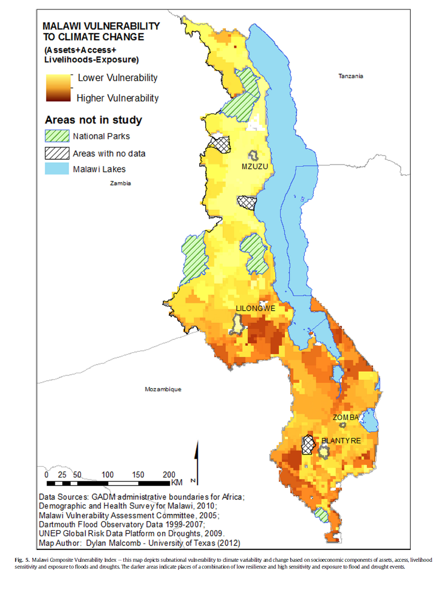

# Purpose

The goal of this lab was to replicate figure 4, a map of resilience scores in Malawi in 2010, and replicate 80% of figure 5, a map of vulnerability to climate change in Malawi, from Malcomb et al paper titled, "Vulnerability modeling for sub-Saharan Africa: An operationalized approach in Malawi." Additionally, the purpose of this lab was to be exposed to the issue of reproducibility and transparency in academic work.

 # Discussion
Reproducibility is a major issue in academia– particularly in GIS and geography. Academics frequently publish papers (even in major journals) with methods and results that are impossible to reproduce because of a lack of data and or vague descriptions of methodology. 

With the increasing relevance of climate change in people’s lives, measuring vulnerability has become a top priority for organizations like the United Nations (Hinkel 2010). Additionally, vulnerability assessments have become especially important because legislation and policy decisions regarding combating climate change hinge on the results of these assessments. Reproducibility and replicability for vulnerability models and analysis is particular difficult. First, there is no standard for “measuring” vulnerability in academia (Hinkel 2010). It requires taking several factors thought to impact vulnerability and synthesizing them into one number. Some people argue that it is impossible to measure vulnerability. Second, there is confusion regarding the purpose of assessing vulnerability– something that’s particularly concerning because vulnerability assessments are carried out for different purposes (Hinkle 2010). 

# Malcomb et al.'s Methodology

The goal of Malcomb et al.'s paper was to use a new approach to vulnerability modeling so that Malawain policy-makers could determine the geographic areas most susceptibal to hazards, climatic change and variability, and degraded livelihood security. In order to determine the vulnerabilities associated with Malawian people, they peformed seventy interviews with government, non- government and development officials along with focus group interviews in eleven villages. They write, "These multi-level, semi-structured in- terviews with experts and stakeholders were essential in identifying Malawi’s distinct socio-ecological issues that included physical exposure to recurring floods and droughts, lack of access to markets, food, water, health care and labor, reduced assets of land, livestock and income and increased livelihood sensitivity to market exposure and agricultural practices" (Malcomb et al. 2015).

# Methodology to Reproduce Analysis

### Software used
  * PostGIS
  * QGIS 3.8 with Grass and GDAL
  * Notepad+++
  
 ### Data Sources
  * UNEP Global Risk Map
  * [DHS Cluster Points](https://dhsprogram.com/What-We-Do/GPS-Data-Collection.cfm)
  * DHS Survey Data
  * [Major lakes from OpenStreepMap via MASDAP](http://www.masdap.mw/layers/geonode:major_lakes)
  * GADM version 2.8 Boundaries for Malawi
  * [DHS Survey Region boundaries](http://spatialdata.dhsprogram.com/boundaries/#view=table&countryId=MW)
  * [FEWSnet Livlihood Zones](https://fews.net/fews-data/335)
  
This analysis used QGIS Desktop 3.8.1 with GRASS 7.6.1 and WGS 84 as the coordinate reference system. I used an extent of 32.66,-17.125: 35.875,-9.375. I used a 2.5 minute resolution (0.04166666 decimal degrees) to make my figure 4. 

## Adaptive Capacity: Summarizing DHS Surveys by Traditional Authroity (TA)

Because the metadata for the DHS survey data is so extensive, our class extracted the variables in Malcolm et al.'s assets and access analysis. We all got assigned a variable and wrote the SQL to reclassify the data into quantiles. Many of us had to make judgement calls because ambiguity in the data. For example, it was unclear whether 1 or 5 were the high or low value.

Professor Holler proofread the code and gave us aggregated TA data. Professor Holler was the only one of us allowed to look at the DHS data directly because he was the only one who filled out the necessary forms to receive access to it.

This SQL file was the result of our collaborative effort: [SQL Code](./vulnerabilitySQL.sql/)

 |Malcomb et al.'s Map|
| ------------- |
||

|My Map|
| ------------- |
||

# Making the Model 

We put the data sources together in an attempt to reproduce Figure 4 from Malcomb et al.'s paper. Professor Holler gave us the [initial model](./vulnerability_course2.model3/) that clipped and rasterized each layer. I 

 |Malcomb et al.'s Map|
| ------------- |
||

|My Map|
| ------------- |
||

# Conclusions
The final map I produced of Malawi's vulnerability to climate change is similar in some ways to the map that Malcomb et al. produced. Both maps had higher degrees of vulnerability in the Northeastern, Southeastern, and Western Central parts of the country. However, my map has more vulnerability in almost all areas near the national parks. Malcomb et al.'s map had higher vulnerability to the South of the major body of water. 

The Traditional Authority maps we both produced were less similar. First, the values are completely different. Malcomb et al.s' resilience score values range from 11.48-25.77 while my values range from 0.752-1.302. The difference in scores makes it difficult to compare the two maps. Regardless, both maps reflect that Southern Malawi as a whole had lower resilience scores than Northern Malawi.

There are several reasons why Malcomb et al. and I got different maps. First, the data is from different time periods. 

The research is not reproducible despite what Malcomb et al. claim. Issues of data accessibility, lack of methodological transparency, and measurement error make this study irreproducible. Malcomb et al. do not provide measurement error or apply sensetivity analysis to show the importance of measurement error in the data (Tate 2012).

Malcomb et al did not adequatley consider error and uncertainty in their paper. Throughout their paper, they use language like "we utilized innovative socioeconomic, livelihood and exposure risk data" or "With experts extensively incorporated in the process" or "these results offer a unique and comprehensive analysis on a subject rarely performed by researchers at this fine scale. It accurately reflects the perceptions of vulnerability to climate change in Malawi while incorporating
data from multiple sources to explain why" that insinuate their analysis was comprehensive and error free.

Based on this experience of trying to reproduce Malcomb et al.'s results, there are several strategies I will now use in order to become a better geographer doing research with GIS. First, data accessibility and transparency are crucial for reproducibility and ensuring integrity among geographers. Thus, I will provide the data sources whenever possible when doing analysis. Second, I will document my methodology and workflow thoroughly by taking screenshots and recording my work as a go instead of waiting until the end to document my process. Third, I will use open-source software and products whenever possible.

There are problems of uncertainty inherent in vulnerability "systems of study" that make it difficult to find similar results applying the same concepts and methods to new cases. While Malcomb et al. made a lot of mistakes throughout every aspect of their paper, their biggest mistake was using language that suggested their methodology and process was comprehensive with little room for error. The world is a complex place, especially when it comes to humans and the changing environment. Conducting 70 interviews in 11 different villages (like Malcomb et al. did in their paper) will never result in the same responses, particularly when it comes to vulnerability. 

# Resources

Hinkel, J. (2011). “Indicators of vulnerability and adaptive capacity”: towards a clarification of the science–policy interface. Global Environmental Change, 21(1), 198-208. https://doi.org/10.1016/j.gloenvcha.2010.08.002

Malcomb, D. W., Weaver, E. A., & Krakowka, A. R. (2014). Vulnerability modeling for sub-Saharan Africa: An operationalized approach in Malawi. Applied geography, 48, 17-30. https://doi.org/10.1016/j.apgeog.2014.01.004

Tate, E. (2012). Social vulnerability indices: a comparative assessment using uncertainty and sensitivity analysis. Natural Hazards, 63(2), 325-347. https://doi.org/10.1007/s11069-012-0152-2
